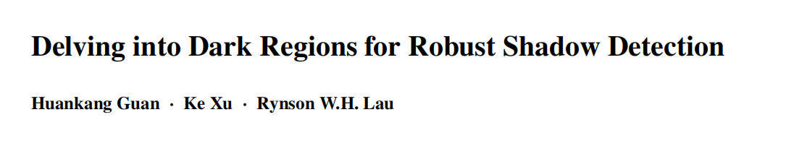
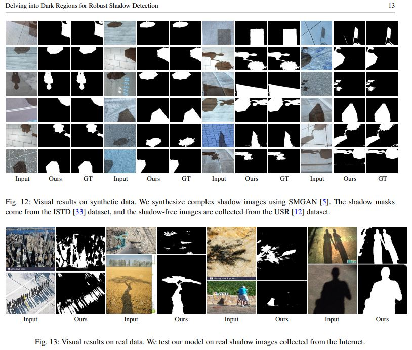
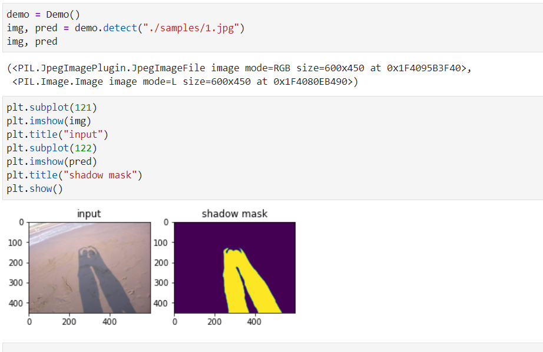

## Delving into Dark Regions for Robust Shadow Detection
**Keywords** Shadow detection *·* Global/local shadow understanding *·* Region-based shadow analysis

> This work was done in 2021.

[<a href="https://arxiv.org/abs/2402.13631">paper</a>] [<a href="https://github.com/guanhuankang/ShadowDetection2021">github</a>]



## Resources

Download model weights and put into folder "models"

SBU: https://drive.google.com/file/d/1oGrisJdjkECRz0XWy_X_rAKLGiKCCilE/view?usp=sharing

ISTD: https://drive.google.com/file/d/1Uib_2XV91HYTqHO3_z6lZDAT2Ir8ss1_/view?usp=sharing


## Demo

We provide a demo in jupyter notebook format "demo.ipynb". Start the jupyter-lab and run all cells for a quick start!




## Inference

1. configurate "config.py"
2. run "infer.py"

```
BER Score:
SBU: 3.04
UCF: 7.75
ISTD: 1.33
```


If you want to train our model, please refer to other/train_script.rar for details.


## Evaluation

1. After the inference, set the tool/config.py
2. Run "cd tool; python start.py"

## Cite
```html
@misc{guan2024delving,
      title={Delving into Dark Regions for Robust Shadow Detection}, 
      author={Huankang Guan and Ke Xu and Rynson W. H. Lau},
      year={2024},
      eprint={2402.13631},
      archivePrefix={arXiv},
      primaryClass={cs.CV}
}
```

